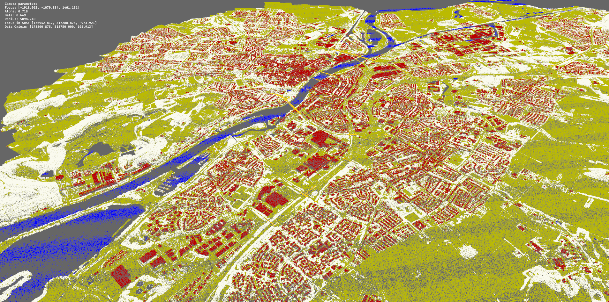

# Code Publication for "Random Data Distribution for Efficient Parallel Point Cloud Processing"

This repository contains a demonstrative implementation for using a random data distribution scheme for point cloud processing. The details of the approach are explained in the paper published in AGILE 2024, the code is supplementary material to this publication. When using the code or the ideas therein, please cite the AGILE publication (see [Citation](#citation)).



## Repository Outline

The code is organized in four modules:

|Module       | Description   |
|-------------|---------------|
|`pc-format` | Contains the internal data representation based on Arrow <br>including indexing and partitioning structures. |
|`pc-io`     | Contains helper functions to read LAS and LAZ files. |
|`pc-server` | Contains the server and worker component providing an <br>API for data management and querying. |

Some documentation and benchmarks are in the [doc](./doc/) respectively [scripts](./scripts/) directory while [assets](./assets/) holds graphics used in the paper.

## Quick Start

### Prepare data

The Netherlands published a large point cloud known as Actueel Hoogtebestand Nederland (AHN) which you can start from when exploring this repository. It is a huge pointcloud which is served as a collection of LAZ files. To download a first example file from the third version, you can use the `ahn.py` script (requires Python >= 3.10).

```bash
# download C_69AZ1.LAZ from AHN3
python scripts/ahn.py --dataset AHN3 --filenames C_69AZ1
```

This will download the file `C_69AZ1.LAZ` into the `./data/AHN3` folder.

### Start server (Docker)

First, build the docker image, then run it interactively with the `./data` folder mounted to `/app/data`.

```bash
# build image with tag `pc-test`
docker build --tag "pc-test" .
# run interactive to see server log
docker run -it --rm -e PORT=3000 -p 3000:3000 -v ./data:/app/data pc-test
```

This will spaw a single worker instance listening on port 3000 as indicated int the console output. 

```bash
# console output
  2024-03-18T13:07:58.790500Z  INFO pc_server: listening on 0.0.0.0:3000
    at pc-server/src/main.rs:25
```

The system, however, is meant for distributed computing and you can use the cluster manager Docker Swarm following additional information in [doc/swarm.md](./doc/swarm.md) to instantiate the system in a distributed fashion.

### Load data

The first step in the data lifecycle of our system is to provide point cloud data to the system. Therefore, you can use the `/load` API endpoint. Currently, only LAS and LAZ files are supported. You can, for example, load the LAZ file previously mentioned as follows:

```bash
# load C_69AZ1.LAZ from AHN3
curl -G '0.0.0.0:3000/load' -d 'uris=./data/AHN3/C_69AZ1.LAZ'
```

A delta parameter can be added to enforce partitioning of the data. For example adding `&delta=1000,1000,1000,0.1` will partition the data into chunks of size 1km (x) by 1km (y) by 1km (z) by 0.1 (importance).

### Query data

At the heart of the system, queries are answered in a randomized fashion. You might want to perform a box query returning points with a chosen probability. Therefore, you can

```bash
# query a random sample of the loaded data
curl -G '0.0.0.0:3000/points?p=0.001' --output ./test.arrows
```

This will return the result as an Arrow IPC stream and store it in the `test.arrows` file. Arrow IPC streams transmit binary data together with a description of their structure. You can peek into this data by converting the response into a Pandas dataframe with `pyarrow` or directly query with `request` in a Python environment.

```python
import pandas
import pyarrow
import requests


# convert the ipc stream to a pyarrow table
table = pyarrow.ipc.open_stream("./test.arrows").read_all()

# alternativly query with request directly
response = requests.get("http://0.0.0.0:3000/points?p=0.0005")
table = pyarrow.ipc.open_stream(response.content).read_all()

# convert table to Pandas dataframe
df = table.to_pandas()

# show head
df.head()
```
You can actually use the same spatial query with varying ranges for the probabilistic importance value (see paper for a detailed explanation), but the following two queries should give you different random samples of the query result:

```bash
# query by x, y, z and importance bounds
curl -G '0.0.0.0:3000/points?bounds=174000,315000,0,0,174060,315060,1000,0.5' --output ./test.arrows
curl -G '0.0.0.0:3000/points?bounds=174000,315000,0,0.5,174060,315060,1000,1' --output ./test.arrows
```

## Citation

```bibtex
@article{teuscher2024datadistr,
  title={Random Data Distribution for Efficient Parallel Point Cloud Processing},
  author={Teuscher, Balthasar and Werner, Martin},
  journal={AGILE: GIScience Series},
  year={2024},
}
```

## License

Licensed under MPL-2.0 license ([LICENSE](LICENSE) or https://opensource.org/license/mpl-2-0)
